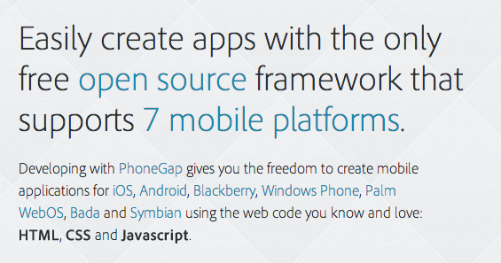
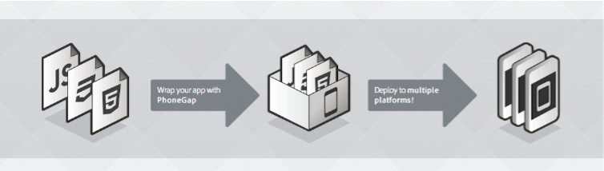
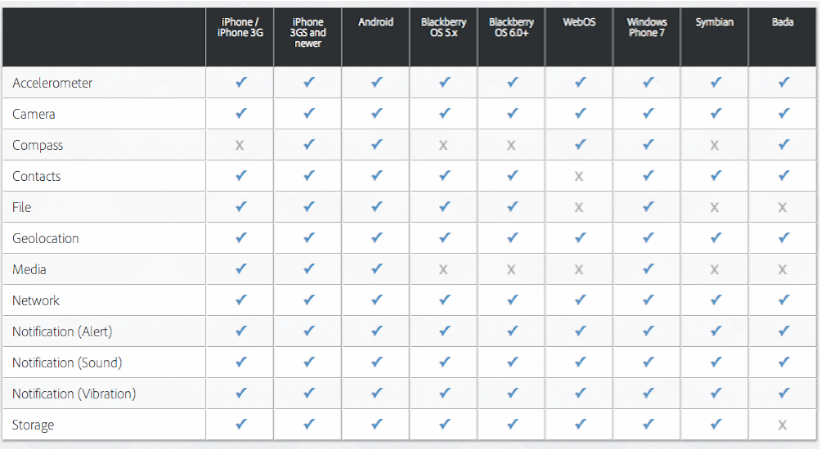
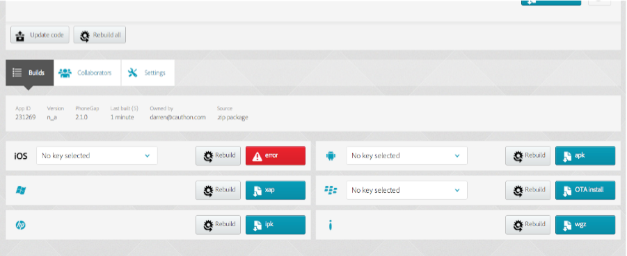
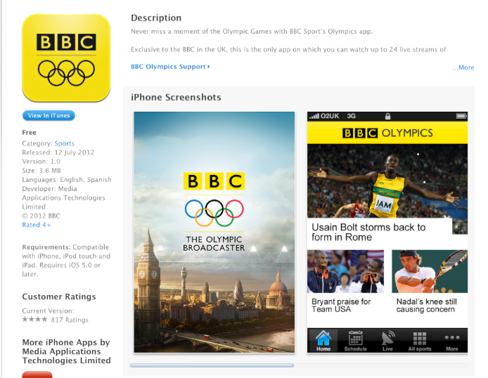
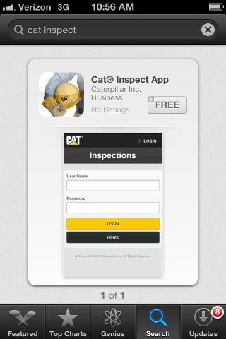
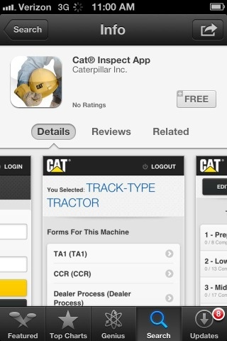
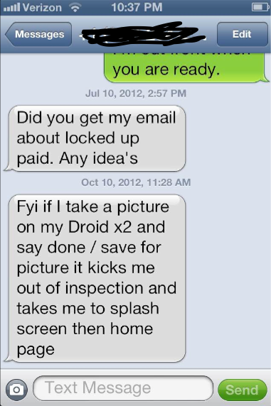

<!SLIDE>
# What is PhoneGap? #

<!SLIDE center>
# Develop native apps with HTML/CSS/JS #

<!SLIDE center>
# Wrap your app, deploy anywhere #

<!SLIDE center>
# Access to Native Phone Features #

<!SLIDE center>
# PhoneGap Build will build the app for you #

<!SLIDE center>
# Used for real apps #

<!SLIDE>
# Is as simple as making a one-page web app #

    <html>
      <body>
        Hello world
      </body>
    </html>

<!SLIDE>
# Native phone features are exposed through a Javascript library #

    // find all Bobs
    var options = new ContactFindOptions();
    options.filter="Bob";
    options.multiple=true; 
    var fields = ["displayName", "name"];
    navigator.contacts.find(fields, onSuccess, onError, options);

<!SLIDE>
# Sounds great in theory, but what about in practice? #

!SLIDE bullets incremental
# Start of my story... #

* A company had an idea...
* to replace paper-based inspection forms...
* with a mobile app...
* that gathered data & pictures for remote inspectors.

!SLIDE bullets incremental
# In Walks the Hero #

* An experienced Rails developer...
* ... but no native app experience...
* says "Hey, let's use Phone Gap!"

!SLIDE bullets incremental
# Development Starts #

* Rails "RESTful" web backend...
* Coffeescript, HAML compilers...
* Backbone.JS, Jasmine tests...
* JQuery Mobile BETA...

!SLIDE bullets incremental
# Prepped for success! #

* All the current dev hotness
* Web work by experienced web devs
* Agile agile agile agile

!SLIDE bullets incremental
# Work starts #
* Results slow, promises increase
* No delivery on the mobile apps
* Demand for more paid hours.
* Missed deadlines.

!SLIDE bullets incremental
# Delivery #
* 
* (this slide intentionally left blank)

!SLIDE bullets incremental
# Issues with the app included #

* iPhone version was unresponsive.
* Android version was responsive... but only in airplane mode and with 20 seconds of lag between clicks.
* Could not take pictures.
* Could not sync data to and from the central server.

!SLIDE bullets incremental
# Issues with the app included #

* Unexpected app crashes.
* Sudden blank pages.
* Weird page zooming.
* Resetting the app required reinstall.

!SLIDE bullets incremental
# I am asked to rescue the app #

* Evaluation process to judge if app was salvagable.
* Switch to week-by-week iterations to show progress.
* Direct contact with all parties for feedback & testing.
* Months and months of fixes & rework.

!SLIDE bullets incremental
# Project Lanches #

!SLIDE bullets incremental
# Project Lanches #

!SLIDE bullets incremental
# Project Lanches #

!SLIDE bullets incremental
# Project Lanches #

!SLIDE bullets incremental
# Let's Go Back #
* For all of the promises of PhoneGap, what happened?

<!SLIDE center>
# Develop native apps with HTML/CSS/JS #

!SLIDE bullets incremental
# On really? #

* Design/Dev techniques from desktop web did not work on mobile.
* The app was incredibly slow.
* It did not behave like a native app.

<!SLIDE center>
# Wrap your app, deploy anywhere #

!SLIDE bullets incremental
# Oh really? #

* App looked different for each device.
* Android support was very spotty.
* Performance issues dogged the app, especially on Android.

<!SLIDE center>
# Access to Native Phone Features #

!SLIDE bullets incremental
# Oh really? #

* iPhone support was pretty good, but...
* Android camera support was very spotty.
* Had issues with file-access support across different devices.

<!SLIDE center>
# It never stopped... #

<!SLIDE center>
# PhoneGap Build will build the app for you #

!SLIDE bullets incremental
# Oh really? #

* We used PhoneGap Build for a while, but...
* SSL logins required XCode.

!SLIDE bullets incremental
* What's the difference between a lawyer and a programmer?
* A lawyer will show you the fine print.

!SLIDE bullets incremental
# Let's Be Honest #
* Nothing is free.
* We push our tech as if it was.

!SLIDE bullets incremental
# Not This Time

!SLIDE bullets
# Tip #1 #

* Acknowledge that smartphones are not desktops.

!SLIDE bullets
# Tip #2 #

* Avoid use of heavy frameworks.
* (Backbone.js, Knockout, Ember, etc.)

!SLIDE bullets
# Tip #3 #
* Watch for web security issues.

!SLIDE bullets
# Tip #4 #

##Avoid "fancy" CSS or advanced rendering.

!SLIDE
# Tip #5 #

##A fast response to a slow process beats a slow response to a fast process.

!SLIDE
# For example #

What's faster than calling 

    methodThatTakesFiveSeconds()?

A call that takes 250 milliseconds more:

    $.mobile.showPageLoadingMsg() 

    setTimeout((()-> methodThatTakesFiveSeconds()), 250)

!SLIDE bullets
# Tip #6 #

* Do not expect the screen to update just because you updated the DOM.

!SLIDE bullets
# Tip #7 #

* Avoid DOM manipulation as much as possible.

!SLIDE bullets
# Tip #8 #

* Test on actual mobile devices daily.

!SLIDE bullets
# Tip #9 #

* Early in development, find out how to disable every mobile-web browser feature.

!SLIDE bullets
# Tip #10 #

* Don't Be Cute.

!SLIDE
# For example #

* This app was written to pull its views in from the server the first time it was run.
* Guess what happened next?

!SLIDE bullets
# Tip #10 #

* Don't test through the view.

!SLIDE bullets
# Tip #11 #

* Adjust your attitude.

!SLIDE bullets incremental
# Attitude... #

* If you are drawn to PhoneGap as a way to leverage your web skills for native devices... 
* ... especially because you think you’re a HTML/CSS/JS wizard/guru/ninja/rockstar...
* ... you’ll fall harder than the rest.

!SLIDE bullets incremental
# Attitude... #

* If you look at PhoneGap as a cost-effective way to create a simple app...
* ... you’ll have a better experience with PhoneGap.

!SLIDE bullets incremental
# Attitude... #

* If you look at PhoneGap as something not to be trusted...
* ... as a technology that provides a passable mobile experience...
* ... and if you are keep your client's expectations realistic... 
* ... you just might be successful with PhoneGap.

!SLIDE bullets incremental
# How Would I Start a New PhoneGap App Today? #

* Buy the front-end from a professional mobile designer.
* Stick with straight-up HTML/CSS/JQuery, with no framework.
* No JQuery Mobile.

!SLIDE bullets incremental
# How Would I Start a New PhoneGap App Today? #

* Use Coffeescript to produce more consistent Javascript.
* Keep the app simple to avoid Android device compatibility issues.

!SLIDE bullets incremental
# How Would I Start a New PhoneGap App Today? #

* Promise little, deliver more.
* Push the client away from complexity or features that won't work well.

!SLIDE bullets incremental
# Bigger Picture #

* PhoneGap is not the sole reason things did start well.
* Constant iterations with regular feedback was the biggest issue.
* PhoneGap took us farther than we could have gone on our own, in the present time.

<!SLIDE center>
# If it doesn't fit, it doesn't fit #

!SLIDE bullets
# Thanks #

* Darren Cauthon
* @darrencauthon
* github.com/darrencauthon
